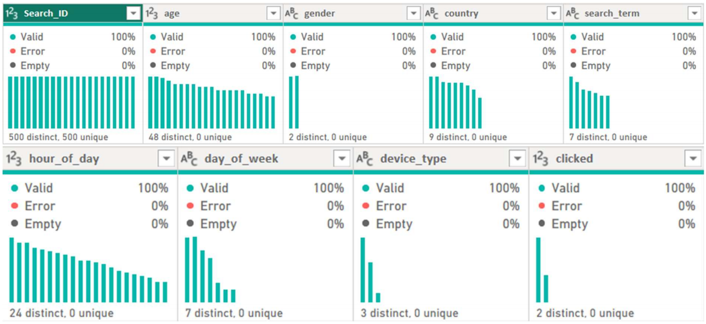

# 📊 Alibaba Group E-commerce Big Data Case Study

### 📘 Course Project: TDA6313-DATA ANALYTICS FUNDAMENTALS

[]()
[]()

## 📦 Project Overview
The **Alibaba Group Case Study** is an extensive analytical research project focusing on modern e-commerce infrastructure, data management, and operational scalability. The research decodes how tech juggernauts like Alibaba leverage vast quantities of Big Data to power recommendation algorithms, hyper-personalization, automated supply chain logistics, and fraud detection on events like *Singles' Day*.

## 📊 Key Topics Covered
*   **Data Acquisition & Storage Analysis:** How semi-structured user data is stored across high-availability data lakes and NoSQL clusters.
*   **Recommendation Systems:** Unpacking the collaborative filtering algorithms responsible for maximizing user engagement.
*   **Logistics (Cainiao):** The mathematical optimization and localized predictive algorithms that streamline global delivery networks.
*   **Cloud Infrastructure:** Evaluations of serverless scaling and localized computing under massive stress tests.

## 🖥️ Relevant Concepts
*   Data Analytics, Machine Learning
*   Cloud Architecture Optimization (AWS / Alibaba Cloud Equivalents)
*   Supply Chain Telemetry

## 📈 Artifacts


*Figure 1: An excerpt from the comprehensive architecture and data flow analysis document.*

## 📂 Project Structure
```text
Alibaba_Group_Case_Study/
├── docs/           # Full-length detailed whitepapers and slide decks
└── assets/         # Infographics, architecture charts, and metrics
```

## 📖 How to Read
1. Open the `/docs` directory.
2. Load the `.pdf` or extensive markdown reports outlining the case study findings.
